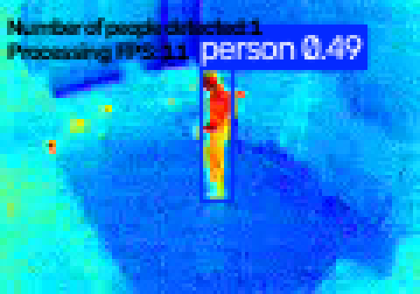
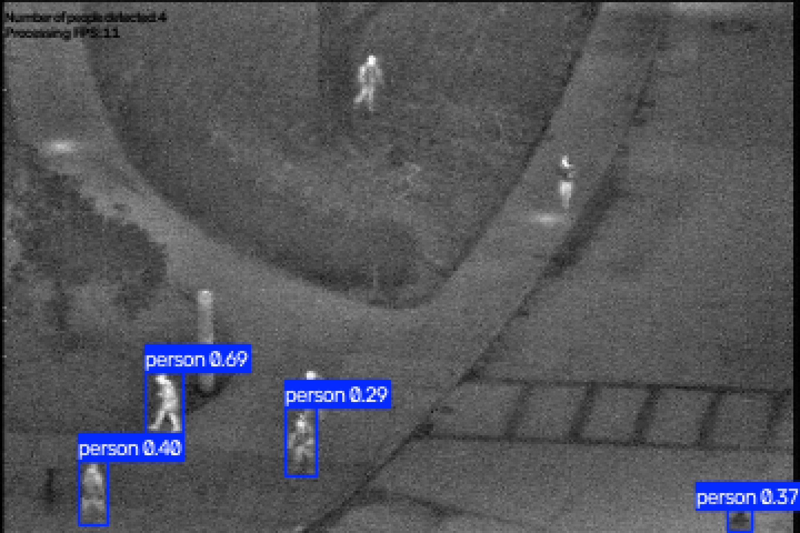

# People Detection in Thermal Imagery

Detects people in thermal video or image sequences using a pretrained YOLO11n model. The output is an annotated video with bounding boxes, detection confidence, people count and processing FPS.

## Setup (Ubuntu/Debian)

Requires Python 3.10+ (tested on Python 3.14.7).

```bash
sudo apt update
sudo apt install python3 python3-venv libgl1 libglib2.0-0 git
git clone https://github.com/annasult/People-recognition-thermal.git
cd People-recognition-thermal
python3 -m venv .venv
source .venv/bin/activate
pip install --upgrade pip
pip install -r requirements.txt
```

On Fedora, install the system packages with `sudo dnf install python3 mesa-libGL glib2 git`; the remaining steps are the same. Tested on Ubuntu (via Podman container, running Ubuntu 26.04.1 LTS), as well as in the clean environment on Fedora 43 (Workstation edition).

## Usage
Basic usage (processes the video and displays the preview window):
```bash
python image_recognition.py --input video.avi --output processed_video.avi
```

Alternatively you can specify the folder with the image frames:
```bash
python image_recognition.py -i ./00001 -o images.avi
```
**Note:** the images must be named `img_00001.bmp`, `img_00002.bmp`, … (5-digit zero-padded, no gaps). The output will be a compiled video of the processed frames.

For more options, such as setting custom confidence threshold or more verbosity, run:
```bash
python image_recognition.py --help
```

## Output
Each frame shows the number of people detected and the processing FPS. If a person is detected, the bounding box is drawn, showing the detection confidence. Only boxes above the threshold set with -c (the default is 50%) are drawn.

| Provided video (25 % threshold) | OSU dataset |
|---|---|
|  |  |

The full processed video (25 % threshold) is available in [`processed_video_25.avi`](results/processed_video_c_25.avi).

The report is printed in the end, stating the model used, and processing time elapsed. A simple metric to evaluate the accuracy is used. The frames with at least one "hit" - one detection are considered succesful. The accuracy then is the ration between succesful and all frames. The total averaged FPS is shown as well.

## Model
The YOLO11n from ultralytics is chosen, because of the robustness of the model, its proven efficiency on a wide set of problems, and simple use of ultralytics API.

## Evaluation
Given the low resolution and the fact that the model was never trained on thermal data, it performs reasonably well on the provided video: the person is detected whenever their silhouette is distinct enough. Since no obvious false detections were noticed, I tested the model under lower and lower confidence levels to increase the detection rate. Using the simplistic metric for the evaluation of accuracy of the model here are the results of the detection under 3 different confidence levels:

| Confidence threshold | Detected frames | Detection rate | False positives |
|---|---|---|---|
| 50 % (default) | 23 / 806 | 2.85 % | none observed |
| 25 % | 62 / 806 | 7.69 % | none observed |
| 20 % | 77 / 806 | 9.55 % | some observed |

Taking into account the false positives counted as hits in 20% results, I consider the 25% confidence level to be optimal. 

### Small and distant people

To be able to answer whether the detection becomes worse for small or distant people, I've taken another dataset: [OSU Thermal Pedestrian Database](http://vcipl-okstate.org/pbvs/bench/Data/01/download.html) (Davis & Keck, OTCBVS benchmark). It consists of 10 collections of images, ranging from 20 to 75 per collection, 284 in total. The photos do have a better quality (360 * 240 pixels), so the model performed better on this dataset. The model was still able to determine the distant people as well as when the person was close to the camera. Some people are still missed.

### Processing speed
Approximately **11 FPS** end-to-end (including drawing and video writing) on Intel(R) Core(TM) i3-8145U, using `yolo11n` on CPU.

## Limitation
- The model is pretrained on the COCO dataset (visible-light RGB images), while the input is thermal imagery.
- Another limitation is the low resolution of the given video. At 120 * 84 pixels a person, especially when in slight distance, or in unusual positions, only spans a few dozens pixels, and is much harder to detect.
- No ground-truth annotations were available for the provided video, so accuracy is approximated by the share of frames containing a detection, and false positives were assessed only visually. 

